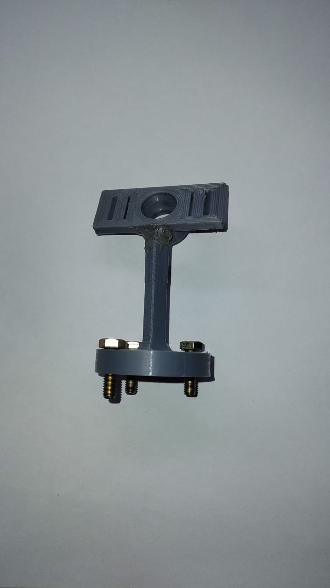
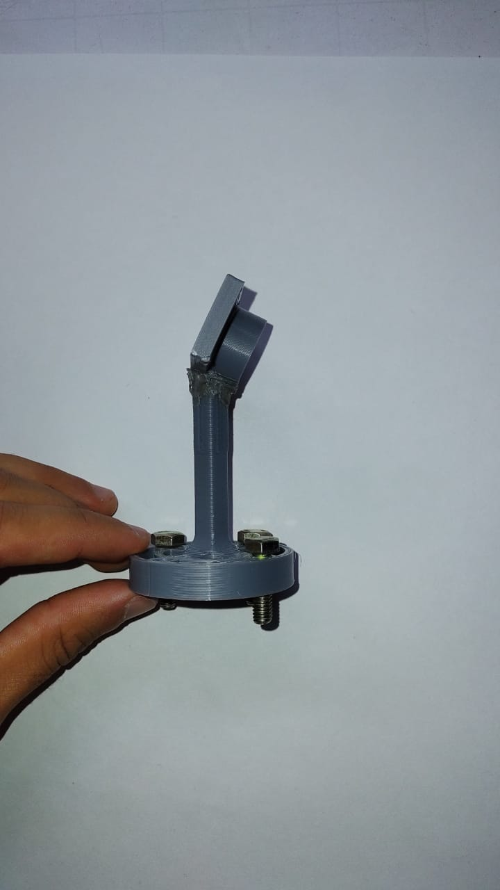
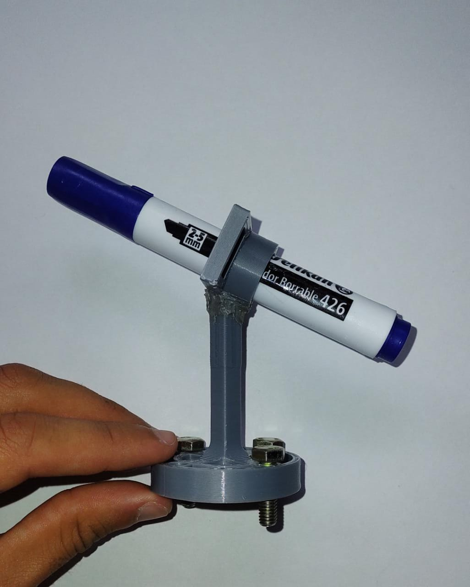
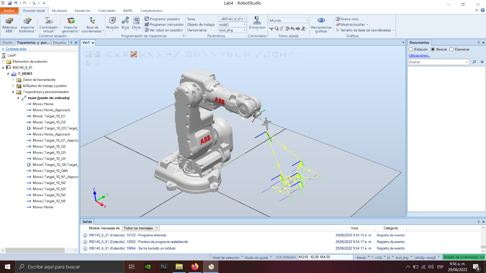
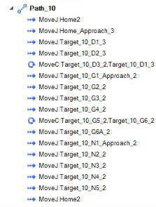
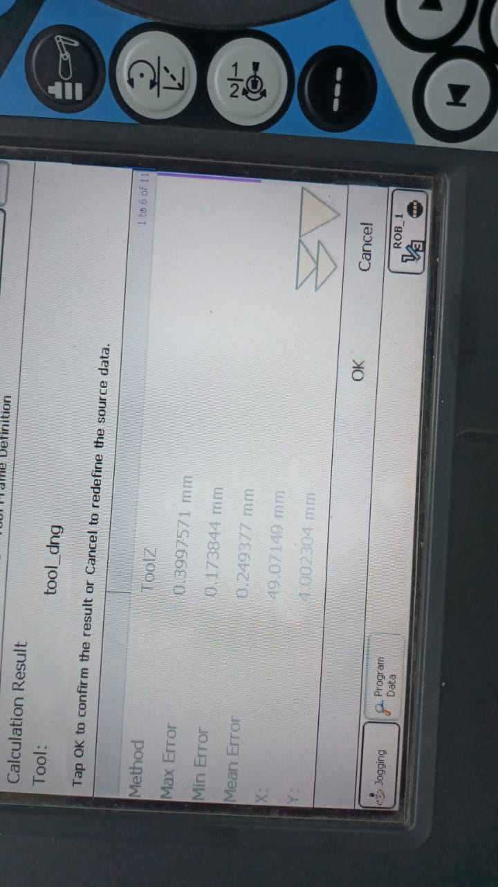

<h1 align="center"; style="text-align:center;">Laboratorio 4: Robótica Industrial No. 1</h1>

Robótica</p1>

   Giovanni Andrés Páez Ujueta

 email: gpaezu@unal.edu.co

   Daniel Esteban Bohórquez Cifuentes

 email: dbohorquezc@unal.edu.co

   Nicolas Pulido Gerena

 email: npulido@unal.edu.co

   INGENIERÍA MECATRÓNICA

 Facultad de Ingeniería

 Universidad Nacional de Colombia Sede Bogotá

 

  

  29 de junio de 2022

## Resumen

Este repositorio presenta el desarrollo de la practica 4 del laboratorio de Robótica, donde se hace uso del manipulador industrial ABB IRB140 para el desarrollo de una rutina que dibuje las iniciales de cada uno de los integrantes del grupo (DGN) en un area determinada de trabajo utlizando un marcador.

## Metodología

### Herramienta

Se realiza el diseño de la herramienta que permita fijar un marcador borrable del robot. Para este diseño te tuvo en cuenta unas ranuras que permiten insertar un resorte para de esa forma el movimiento del marcador sea continuo, se muestra el diseño en CAD y se procede a construirlo por medio de impresión 3D como se puede ver en la figura.

  
  

Se hace el montaje del marcador en la herramienta para visualización y verificación.

  

Luego de esto, se hace la importación del modelo CAD de la herramienta a RobotStudio y de esa forma empezar a plantear la rutina del robot.

### Rutina del robot

#### Creación de Workobjects

Con la herramienta importada a RobotStudio se procede a crear un Workobject, con el fin de trabajar desde alguna orientación o posición de plano diferene, donde se define un sistema de coordenadas diferente. Para este caso el Workobject se define desde una superficie rectangular.

  

#### Creación de Targets

Los Targets son puntos con una determinada posición y orientación que llegarán al robot con su TCP. En este caso esos objetivos se definirán en el Workobject creado. Esos objetivos tendrán una posición en x e y del sistema de coordenadas del Workobject. La siguiente imagen muestra todos los targets hechos en RobotStudio que conforman las letras iniciales de los integrantes del grupo.

  

Esos nombres se pueden encontrar en la declaración de variables en el código fuente. Aquí puede ver cómo todos esos objetivos pertenecen al Workobject llamado "wobj0".

  

De la misma forma se muestran los Targets hechos en RobotStudio que conforman las letras iniciales, ahora en un plano de 30°

  

Esos nombres se pueden encontrar en la declaración de variables en el código fuente. Aquí puede ver cómo todos esos objetivos pertenecen al Workobject llamado "Rotada_30G".

  

##### Creación de Paths

Los Paths permiten indicar la forma en que se desea que el TCP vaya de un destino a otro. En este caso, se trabajó desde el main path para desarrollar las letras D, G y N.

En este laboratorio se trabajaron tres movimientos principales:

- **MoveJ**: Movimiento entre Targets usando movimientos libres de las articulaciones.
- **MoveL**: Movimiento entre Targets siguiendo una linea recta
- **MoveC**: Movimiento entre Targets siguiendo un arco o trayectoria curva.

Estos movimientos se pueden ver en el main path desarrollado y en el path denominado "Path_10":

  
  

Es importante explicar que para mover el TCP de un objetivo a otro, es necesario configurar la zona. Este es un parámetro que permite determinar qué tan cerca va a estar el TCP del objetivo para considerar que ya alcanzó la posición deseada. En este caso, ese parámetro se estableció en "z5" permitiendo un valor de toletancia entre el TCP y el objetivo propuesto. Otro parámetro que se tuvo en cuenta fue la velocidad del movimiento que se configuró entre v100 y v200, es decir, entre 100 mm/s y 200 mm/s.

### Calibración de la herramienta
Una vez hecho el proceso en RobotStudio, se empieza a utilizar el manipulador real, por lo que se empieza la calibración de la herramienta y se procede a montarla en el manipulador y se comprueba que encaja correctamente.

  

## Videos

## Conclusiones
Configurar todos los componentes para crear la ruta para el TCP fue una tarea realmente fácil. Después de saber cómo funciona el software, fue fácil comprobarlo e intentarlo de nuevo si era necesario con la ayuda de simulaciones. Sin embargo, la vida real tiende a ser bastante diferente. Es muy importante tener en cuenta todos los obstáculos que pueden aparecer en el camino a la hora de comprobar el comportamiento en un entorno real. Este tipo de cosas ocurren no solo en un espacio académico sino también en la industria.

El resorte de la herramienta jugó un papel fundamental en el laboratorio debido a la irregularidad del tablero, podría verse como algo trivial en el mundo académico usando un marcador, pero en una aplicación industrial del mundo real, el resorte o un sistema equivalente podría ser fundamental para el correcto comportamiento de la herramienta.

